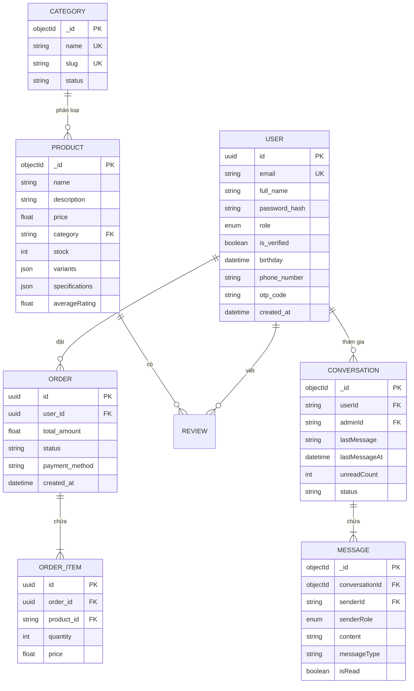

# 🗄️ Sơ đồ Cơ sở dữ liệu (Database Schema)

Hệ thống sử dụng kiến trúc **Polyglot Persistence**, kết hợp giữa **PostgreSQL** cho dữ liệu quan hệ/giao dịch và **MongoDB** cho dữ liệu phi cấu trúc/linh hoạt.

## 1. Sơ đồ thực thể (ER Diagram)

## 2. Chi tiết các dịch vụ

### 🔒 Auth Service (PostgreSQL)
- **Bảng `users`**: Lưu trữ thông tin định danh người dùng. 
- **Bảo mật**: Sử dụng UUID làm khóa chính để đảm bảo an toàn khi liên kết giữa các Microservices.

### 📦 Product Service (MongoDB)
- **Collection `products`**: Lưu trữ thông tin chi tiết sản phẩm, bao gồm các `variants` (màu sắc, dung lượng) và `specifications` dưới dạng Map linh hoạt.
- **Collection `categories`**: Quản lý danh mục sản phẩm.

### 💬 Chat Service (MongoDB)
- **Collection `conversations`**: Quản lý phiên chat giữa khách hàng và Admin.
- **Collection `messages`**: Lưu trữ nội dung tin nhắn, hỗ trợ nhiều định dạng (text, image, file).

### 🛒 Order Service (PostgreSQL - Dự kiến)
- **Bảng `orders`**: Lưu trữ thông tin tổng quát của đơn hàng.
- **Bảng `order_items`**: Lưu trữ chi tiết từng sản phẩm trong đơn hàng, liên kết với `product_id` từ Product Service.

---

